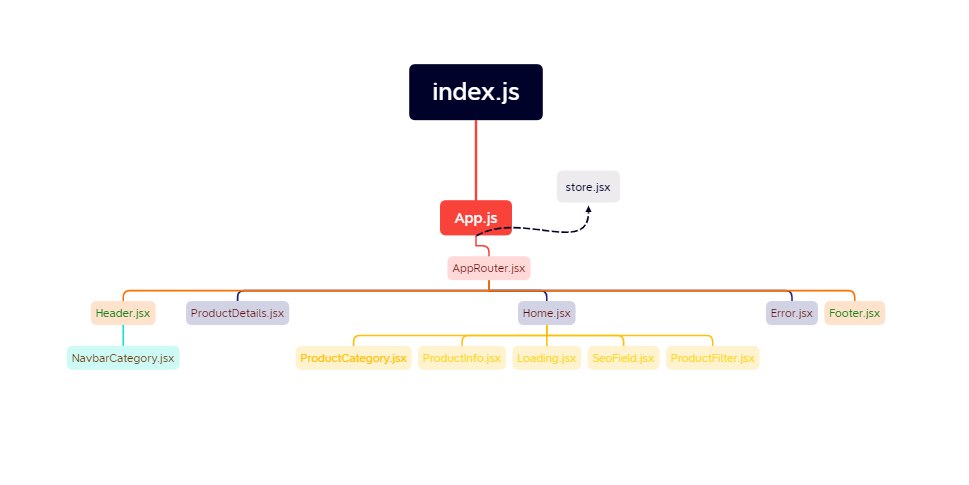

## [See the Page](https://https://mazaka.vercel.app/)

- I built the project with React.
- The project consists of three main pages. Each page has a header and footer section.
  1.  Home page : On this page, the products are listed with the data I pulled from the api with axios. We can also list products by category. When we click on the product, it redirects to the detail page of the product.
  2.  ProductDetail page : On this page, we can see the product clicked on the homepage in detail. At the same time, when we hover over the photo, we can see the product by zooming. We can go to the home page by clicking the "Ana Sayfa" button on the product or clicking on the store logo.
  3.  Error page
- I designed the project with SASS and Bootstrap (SASS version). Since it is a food-based store, I chose orange, green and light colors as colors.
- The project is a responsive design.
- I used React-Helmet library for SEO rules.
- Tools I used in the project;
  - Redux/Toolkit,
  - Axios,
  - Bootstrap,
  - SASS,
  - React-Helmet,
  - React-Icons,
  - React-Image-Magnify,
  - React-Redux,
  - React-Router-Dom.

